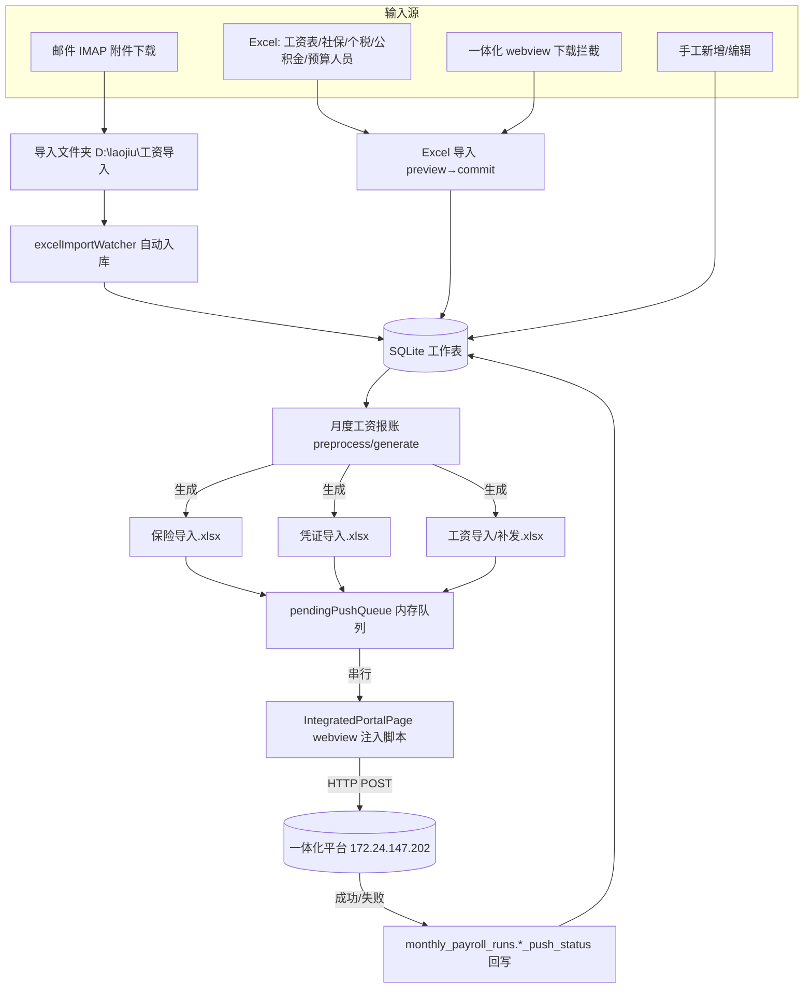
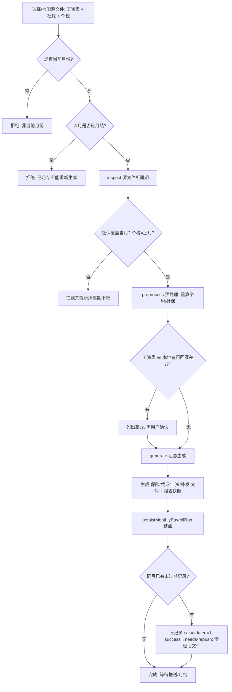
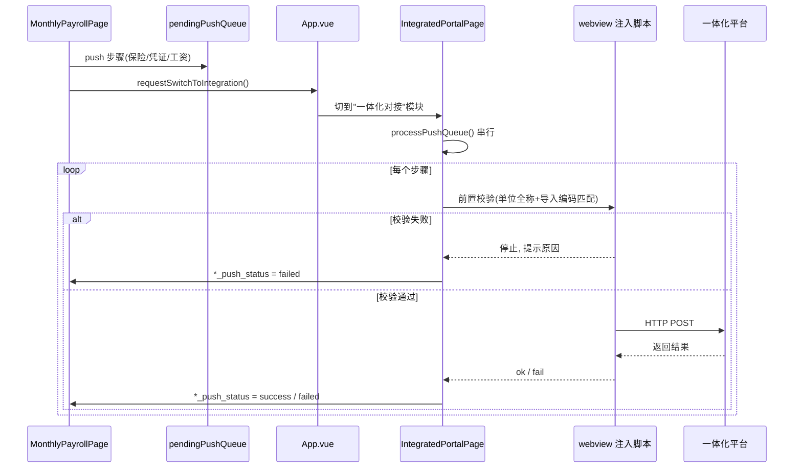
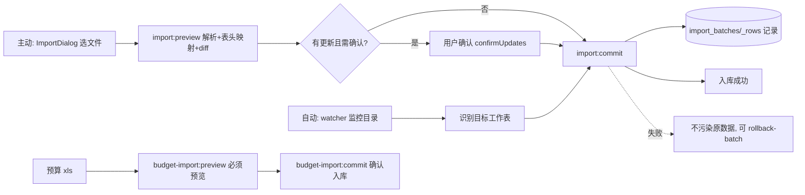
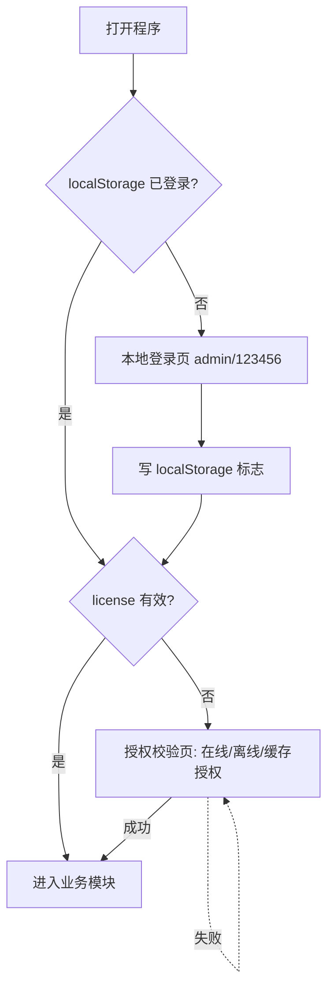

# 01 · 当前系统实际流程图

> 本图基于代码实际走向绘制，非设计意图。Mermaid 代码块在支持 Mermaid 的查看器中可渲染为图。

本应用是**学校/教育单位工资业务桌面端**，核心价值：把本地工资数据加工成各类导入文件，并通过内嵌 webview **自动推送到"预算管理一体化"政务平台**（内网 `172.24.147.202`）。

---

## 1. 总流程（用户 → 前端 → 后端 → DB → 第三方）

---

## 2. 月度工资报账流程（核心）

入口：`MonthlyPayrollPage.vue` → `salaryApi.runWorkflow('monthly-payroll.preprocess' | '.generate')` → `workflowRegistry.ts` → `monthly-payroll/monthlyPayroll.ts`。

**月结归档（archive）**：`monthlyPayrollRuns.ts` `archiveMonthlyPayrollRun`
- **前置硬条件**：必须有 `sourceSocialPath` 且 `insuranceImportPath`，否则报"社保未补齐，当前只是工资阶段结果，不能月结"。
- 动作：源文件 + 生成文件搬入归档目录 → 写 `工资报账月结_清单_*.json` → **清空"补发工资/补扣工资"调整字段** → 重算工作表。
- 逆操作 `cancelMonthlyPayrollMonthClose`：还原源文件、还原调整字段、清生成文件。

---

## 3. 一体化推送流程

队列：`integration/insurancePushQueue.ts`（`pendingPushQueue = ref<PushStep[]>`）。三种步骤：
- `insurance`：保险记录 → `POST /pay-voucher-server/.../savePayRawData`
- `voucher`：凭证文件 base64 → `POST /gld-account-server/.../gl_import_file_json`（multipart）
- `salary-system-import`：工资变动/补发 Excel 导入

**失败路径**：找不到菜单 / 页面未登录 / 单位不匹配 / 文件为空 / 接口返回失败 / 保存后未返回列表 → 停队列并提示。
**异常路径**：webview 跨域 frame 执行失败被吞（`appApi.ts` `exec-in-all-frames` 单 frame 失败不影响其它）；`HWACCESSTOKEN` 未生成时提示"请先手动进一次预算编制页"。

---

## 4. 导入流程（成功/失败/异常）

- 预算 xls **不允许下载即写库**，必须 `preview` 后 `commit`。
- webview 下载拦截（`main.ts`）只拦"工资导出"与"预算人员信息"两类，其余走系统另存为。

---

## 5. 登录与授权门禁流程

- 登录是前端 `localStorage` 软门（`App.vue` 写死 `admin/123456`）；真实门禁靠 license（`assertLicenseForChannel`）。
- 未授权时大部分业务 IPC 被拦截，少数白名单通道放行（见 [03-interface-inventory.md](03-interface-inventory.md)）。
- 机器码由硬件指纹生成；离线授权 `.lic` 用公钥验签。
