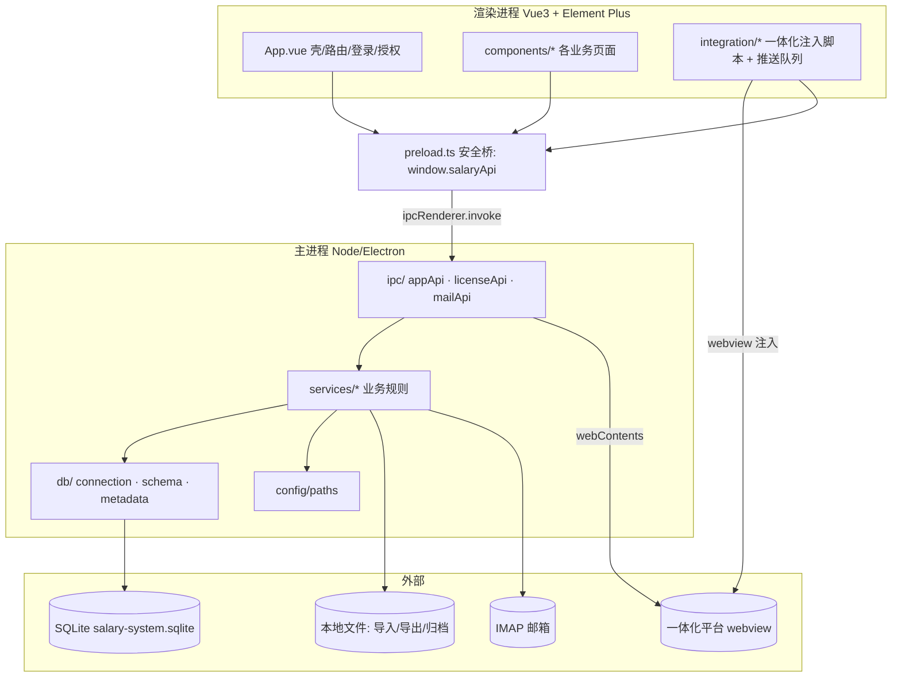

# 02 · 当前模块职责图

## 1. 分层架构

**边界规则（来自 `docs/maintenance-guide.md` §2，代码基本遵守）**：
- 计算规则放 `app/src/main/services/`。
- 页面展示放 `app/src/renderer/src/components/`。
- 一体化注入脚本放 `app/src/renderer/src/integration/`。
- 前后端共享类型放 `app/src/shared/types.ts`。
- 渲染进程**不直接访问 SQLite**，只通过 preload 的 typed IPC。

---

## 2. 主进程业务模块职责（services/）

| 模块/目录 | 职责 | 关键文件 |
|---|---|---|
| 月度工资报账 | 预处理/汇总生成、报账历史、推送状态机、月结归档、个税/社保重算 | `monthly-payroll/monthlyPayroll.ts`(2087)、`monthlyPayrollRuns.ts`、`integratedPayroll.ts`、`voucherSheet.ts`、`monthlyPayrollParsers.ts`、`printSalaryViaExcel.ts` |
| Excel 导入 | 解析、表头/字段映射、diff 预览、批次记录、回滚、目录监控 | `excelImport.ts`(2232)、`excelImportWatcher.ts`、`worksheetInference.ts`、`budgetExcelImport.ts` |
| 年初调整 | 社保/个税年初调整、生成工资/住房/个税/社保基数导入、回写确认 | `annualAdjustment.ts`(1460) |
| 绩效工资 | 两期工资历史对比、识别晋级/退休/调入调出 | `performancePayroll.ts` |
| 工资年报 / 统计 / 透视 | 年报生成、统计报表+下钻、透视分析+导出 | `annual-report/`、`statReports.ts`(1015)、`pivot.ts`、`pivotExport.ts` |
| 预算 | 预算 xls 入库、从一体化同步预算字段 | `budget/integratedBudgetSync.ts`(1337)、`budgetActiveHrSync.ts`、`budget/*` |
| 人事主数据/一致性 | 主数据同步、跨源一致性审计 | `consistencyAudit.ts`、`hrMasterSync.ts`、`teacherDetailHrSync.ts`、`townshipHrSync.ts`、`rankResumeImport.ts` |
| 乡镇补贴/退休房补 | 分段算补贴、补全身份证、新房补核算与写回 | `township-allowance/townshipAllowance.ts`、`housing-subsidy/newHousingSubsidy.ts` |
| 授权 | 在线/离线/缓存授权、机器码、硬件指纹 | `licenseService.ts`(899)、`hardwareFingerprint.ts` |
| 邮件 | IMAP 账号/规则/检查/下载记录/日志 | `mail/*` |
| 工作流注册 | 把业务规则登记为可执行工作流（仅 6 个） | `workflowRegistry.ts` |
| 操作审计/回收站 | 批次快照、记录/文件变更日志、恢复 | `operationLog.ts` |
| 基础/工具 | 单位设置、路径、备份、人员状态、对照表查找等 | `unitSettings.ts`、`config/paths.ts`、`backup.ts`、`personnelStatus.ts`、`schoolLookup.ts`、`lookupSeeds.ts` |

---

## 3. 渲染进程组件职责（components/）

| 组件 | 职责 |
|---|---|
| `App.vue`(2281) | 应用壳：模块导航、登录页、授权页、通用工作表展示、主数据同步弹窗、导入通知 |
| `MonthlyPayrollPage.vue`(3285) | 月度工资报账主页：源文件、预处理、生成、打印、推送入队、月结/取消月结 |
| `WorksheetView.vue`(1921) | 通用表格视图（元数据驱动）：列表/筛选/视图/人员关联子记录 |
| `IntegratedPortalPage.vue`(1077) | 一体化门户：webview 多标签、推送队列消费、预算预览入库、下载监听、（录制工具挂载） |
| `AnnualAdjustmentPage.vue` | 年初调整：选文件、预览、应用、个税/社保基数导出 |
| `PerformancePayrollPage.vue` | 绩效工资：两期对比生成 |
| `PivotPage.vue` / `StatReportPage.vue` | 透视 / 统计报表 |
| `SettingsDialog.vue` | 单位设置、备份/恢复、回收站、导入目录、试用授权、清库 |
| `ImportDialog.vue` | Excel 导入预览/提交/批次/回滚 |
| `MailAttachmentPage.vue` | 邮件账号管理、检查、记录、日志（⚠ 未接"下载规则"） |
| `ConsistencyAuditPage.vue` | 一致性审计运行与应用 |
| `RecordFormDialog.vue` / `FieldStructureDialog.vue` | 记录新增编辑 / 字段结构查看 |

**前端模块导航（`App.vue` modules）**：一体化对接、工资数据(在职/退休/其他工资)、工资业务(月度/绩效/年初调整)、预算(预算在职/退休/其他)、工资年报(工资年报/绩效工资)、乡镇补贴、退休房补(人员明细导出/新房补)、统计分析、人事管理(人事信息+教职工系列+职级简历)。
> 未在导航出现的表：退休养老金、三张对照表、学校对照表、社保/个税/公积金明细、预算行政在职/离退休（多为导入驱动或后端内部用，是否需入口 **待确认**）。

---

## 4. 一体化注入脚本职责（integration/）

| 文件 | 职责 |
|---|---|
| `insurancePushQueue.ts` | 跨页共享推送队列 + "切到一体化"回调注入 |
| `pushInsuranceScript.ts` / `pushVoucherScript.ts` | 保险/凭证推送脚本 |
| `salaryExportScript.ts` | 一键导出工资 |
| `salaryQuotaMatchScript.ts`(1579) | 额度匹配（"额度匹配"自动化） |
| `salaryPlanInputScript.ts` / `salaryPlanInput.user.js` | 计划录入 |
| `autoVoucherEntryScript.ts` / `voucherMergeScript.ts` | 自动凭证录入 / 凭证合并 |
| `salarySystemImportScript.ts` | 工资系统导入（工资变动/补发） |
| `integrationModuleNavigationScript.ts` / `integrationPushPreflightScript.ts` | 模块导航 / 推送前置校验 |
| `recorderScript.ts` / `recorderDevTools.ts` / `portalDomRecorderScript.ts` | 页面录制（⚠ 开发能力，正式包策略见 07） |
